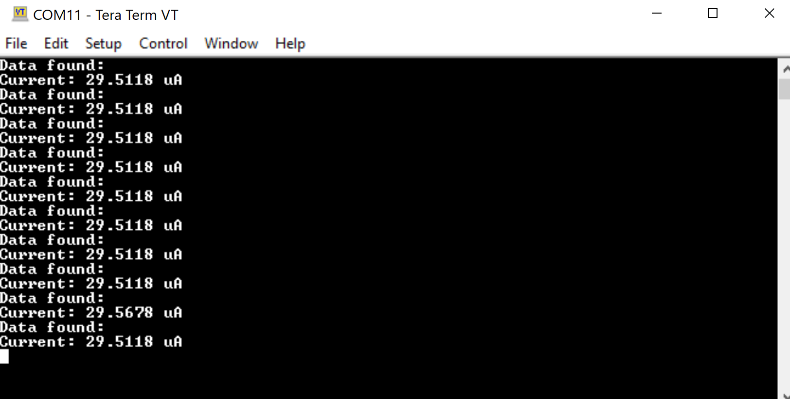
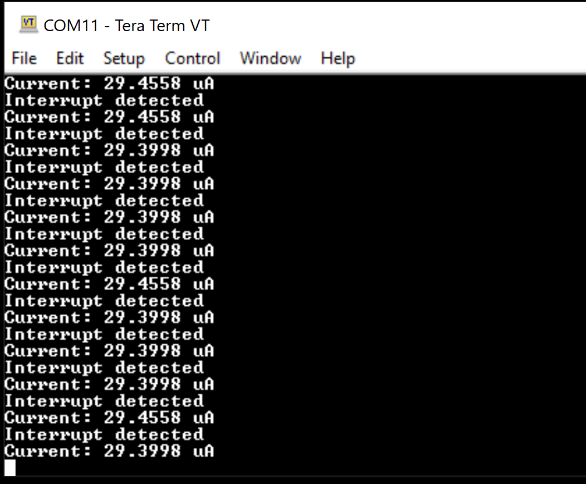

# BL654-nRF52840
BL654 (nRF52840) board connected to AD5940/41 electrochemical front end from Analog Devices to implement voltametric, amperometric, and impedaometric measurements.     

Connect the two boards according to the following:      

        

     

          

The results from the examples are shown below.      

Results from differential voltage measurements:   

           

Results from amperometric example - polling measurements:  

        

Results from amperometric example - interrupt-based measurements:  

   

Results from Chrono-amperometric example - interrupt-based measurements:       

             

