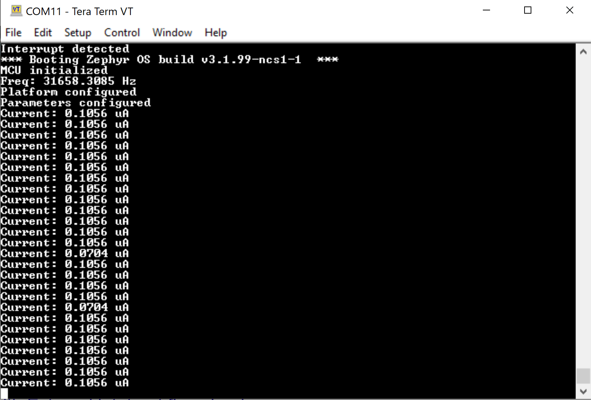

# BL654-nRF52840

BL654 (nRF52840) board connected to AD5940/41 electrochemical front end from Analog Devices to implement voltametric, amperometric, and impedometric measurements.     

Connect the two boards according to the following:      

      

     

      

The results from the examples are shown below.      

Results from differential voltage measurements:

       

Results from amperometric example - polling measurements:      

      

Results from amperometric example - interrupt-based measurements:      

      

Results from Chrono-amperometric example - interrupt-based measurements:     

  
